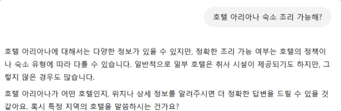
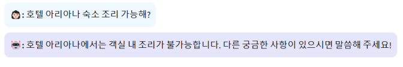
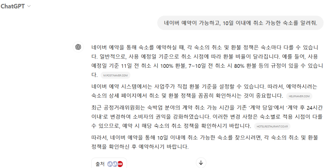
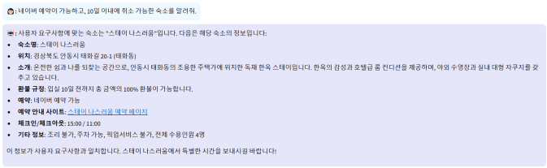

# SKN07-3rd-1Team

# 3차 프로젝트

## 1. 팀 소개
-
  <table>
  <tr>

    <th>김나예</th>
    <th>김서진</th>
    <th>유수현</th>
    <th>정승연</th>
   
  </tr>

  <tr>
    <td></td>
    <td></td>
    <td></td>
    <td></td>
  </tr>
  <tr></tr>

    <th>프롬프트 작성, streamlit 연동</th>
    <th>streamlit 화면 구현</th>
    <th>데이터 전처리</th>
    <th>RAG 구현</th>
  </tr>
  </table>

---
 
## 2. 프로젝트 개요

### 2.1 프로젝트 명

> **📂숙박구리🦝**
- 지역별 숙박 정보 제공 및 맞춤 추천 챗봇 

### 2.2 프로젝트 소개

> 작다는 것 그 이상

적은 데이터지만, LLM과 함께 보다 상세한 정보를 제공합니다.<br>
GPT도 정확히 알 수 없는 부대시설, 객실 어메니티 정보를 알려주고,<br>
세세한 요구사항에도 맞춤형 숙박업소를 추천을 해주는 질의응답 시스템입니다.


### 2.3 프로젝트 필요성 및 배경
  
관광 산업은 전 세계적으로 중요한 경제 활동 중 하나로 그 중에서도 숙박은 필수적인 요소로 자리 잡고 있습니다. 여행 계획을 세울 때 가장 많은 시간을 소비하는 부분 중 하나가 숙박시설을 찾는 것이기에 사용자들에게 정확하고 빠른 정보를 제공함으로 시간과 노력을 절약할 수 있다는 점에서 사용자들에게 편리함을 줄 수 있습니다. 또한 인공지능과 자연어 처리 기술의 발전을 이러한 정보 검색 과정에 도입한다면 더 편리하게 사용자가 원하는 맞춤형 숙박 추천을 해줄 수 있어 여행에 대한 만족도가 더 높아질 수 있습니다.

  
### 2.4 프로젝트 목표

- 한국관광공사 데이터와 **LLM을 연동한 질의 응답 시스템** 구축
- 편리하고 직관적인 **UI 인터페이스**
- **RAG 방식**을 접목해 보다 구체적이고 정확한 답변 제공

---
## 3. 수행 과정

### 3.1 데이터 수집 및 형태 잡기(데이터전처리정리.ipynb 전체내용 있음)
- Open API 활용 : TourAPI 4.0 

- 전체 숙소 리스트를 가져오는 api로 숙소의 명칭과 contentid, contenttypeid 리스트화 (infoDF)
``` python
import requests
from bs4 import BeautifulSoup
import pandas as pd
mykey = '비밀'
url = f'http://apis.data.go.kr/B551011/KorService1/searchStay1?areaCode=&sigunguCode=&ServiceKey={mykey}&listYN=Y&MobileOS=ETC&MobileApp=AppTest&arrange=A&numOfRows=3900&pageNo=1'
rt = requests.get(url)
items = BeautifulSoup(rt.text).select('item')

data = []
for x in items:
    title = x.find('title').text
    contentid = x.find('contentid').text
    contenttypeid = x.find('contenttypeid').text
    
    data.append({'title': title, 'contentid': contentid, 'contenttypeid' : contenttypeid})

infoDF = pd.DataFrame(data)
``` 
- infoDF 를 사용해 개별 숙소의 기본정보, 숙소정보, 객실정보 조회 api를 사용해 데이터 취합 및 DF 작성
``` python
# 데이터 취합
infoData = []
from tqdm import tqdm
for x in tqdm(range(3887)):
    # infoDF 데이터 사용
    title = infoDF.loc[x]['title']
    contentid = infoDF.loc[x]['contentid']
    contenttypeid = infoDF.loc[x]['contenttypeid']

    # 기본정보 조회함수 : 주소, 설명, 이미지링크
    addr1, overview, imglilk = selectInfo2(contentid, contenttypeid)
    # 숙소정보 조회함수 : 숙소의 전제적인 정보
    txtinfo = sukso_info(contentid, contenttypeid)
    # 객실정보 조회함수 : 숙소에 속하는 객실별 정보 리스트로 get
    all_room_info = room_info(contentid, contenttypeid)

    infoData.append({'title': title, 'addr1': addr1, 'overview' : overview, 'imglilk' : imglilk, 'txtinfo' : txtinfo, 'all_room_info' : all_room_info})

# DF 
suk_data = []
for x in infoData:
    name = x['title']
    address = x['addr1']
    overview = x['overview']
    imglink = x['imglilk']
    generalInfo = x['txtinfo']
    roomInfo = x['all_room_info']
    
    
    suk_data.append({'name': name, 'address': address, 'overview' : overview, 'imglink' : imglink, 'generalInfo' : generalInfo, 'roomInfo' : roomInfo})

suksoDF = pd.DataFrame(suk_data)

``` 

- 취합 데이터의 오류 정정 및 가중치 부여를 위한 tag 작성 
  - 지역을 tag에 포함
  ``` python
  # 태그 추출 함수 (최적화)
  def extract_tag(row):
      # 주소 추출
      road_address = row['address']
      
      # 주소가 유효하고 2개 이상의 단어로 구성된 경우 사용
      if pd.notna(road_address) and len(road_address.split()) >= 2:
          return ' '.join(road_address.split()[:2])

      
      # 둘 다 유효하지 않을 경우
      return '없음'

  suksoDF['tag'] = suksoDF.apply(lambda row: extract_tag(row), axis=1)

  ```

  - 영어주소 -> 한글 변경 
  ``` python
  suksoDF['tag'].unique() # 잘못 입력된 내용 확인 후 
  # 주소 오류 수기 수정
  suksoDF.loc[suksoDF['address'].str.contains('18, Hoegi-ro', na=False), 'address'] = '서울특별시 동대문구 회기로 29길 18'
  suksoDF.loc[suksoDF['tag'].str.contains('18, Hoegi-ro', na=False), 'tag'] = '서울특별시 동대문구'

  ```

  - 태그 강화를 위해 지역명 tag 추가 
  ``` python
  suksoDF.loc[suksoDF['tag'].str.contains('강원도', na=False), 'tag'] = suksoDF['tag'] + ' 강원특별자치도'
  suksoDF.loc[suksoDF['tag'].str.contains('강원특별자치도', na=False), 'tag'] = suksoDF['tag'] + ' 강원도'
  suksoDF.loc[suksoDF['tag'].str.contains('경기도', na=False), 'tag'] = suksoDF['tag'] + ' 경기'
  suksoDF.loc[suksoDF['tag'].str.contains('경상남도', na=False), 'tag'] = suksoDF['tag'] + ' 경상도'
  suksoDF.loc[suksoDF['tag'].str.contains('경상북도', na=False), 'tag'] = suksoDF['tag'] + ' 경상도'
  suksoDF.loc[suksoDF['tag'].str.contains('광주광역시', na=False), 'tag'] = suksoDF['tag'] + ' 광주'
  suksoDF.loc[suksoDF['tag'].str.contains('대구광역시', na=False), 'tag'] = suksoDF['tag'] + ' 대구'
  suksoDF.loc[suksoDF['tag'].str.contains('대전광역시', na=False), 'tag'] = suksoDF['tag'] + ' 대전'
  suksoDF.loc[suksoDF['tag'].str.contains('부산광역시', na=False), 'tag'] = suksoDF['tag'] + ' 부산'
  suksoDF.loc[suksoDF['tag'].str.contains('서울특별시', na=False), 'tag'] = suksoDF['tag'] + ' 서울'
  suksoDF.loc[suksoDF['tag'].str.contains('세종특별자치시', na=False), 'tag'] = suksoDF['tag'] + ' 세종'
  suksoDF.loc[suksoDF['tag'].str.contains('울산광역시', na=False), 'tag'] = suksoDF['tag'] + ' 울산'
  suksoDF.loc[suksoDF['tag'].str.contains('인천광역시', na=False), 'tag'] = suksoDF['tag'] + ' 인천'
  suksoDF.loc[suksoDF['tag'].str.contains('전라남도', na=False), 'tag'] = suksoDF['tag'] + ' 전라도'
  suksoDF.loc[suksoDF['tag'].str.contains('전북특별자치도', na=False), 'tag'] = suksoDF['tag'] + ' 전라북도 전라도'
  suksoDF.loc[suksoDF['tag'].str.contains('제주특별자치도', na=False), 'tag'] = suksoDF['tag'] + ' 제주도 제주'
  suksoDF.loc[suksoDF['tag'].str.contains('충청남도', na=False), 'tag'] = suksoDF['tag'] + ' 충청도'
  suksoDF.loc[suksoDF['tag'].str.contains('충청북도', na=False), 'tag'] = suksoDF['tag'] + ' 충청도'

  ```

  - 소개문구내 특정 문구 추출해 tag입력 (시간 부족으로 인해 추가 정리 필요: '오션뷰', '바다', '도심지' 등의 키워드)
  ``` python
  suksoDF.loc[suksoDF['overview'].str.contains('한옥', na=False), 'tag'] = suksoDF['tag'] + ' 한옥'

  ```
- 위 작성 데이터 저장 
``` python
suksoDF.to_csv('./data/suksoDF.csv', index=False, encoding='utf-8')
```

### 3.2. 텍스트 벡터화 및 Chromadb 저장 
- 전처리한 데이터를 벡터화
  - OpenAI 임베딩 text-embedding-ada-002 모델 사용
- Chromadb 저장
  ``` python
  # Document 객체 생성
  # page_content: 속성 값, metadata: ID 값 
  Document(page_content=f"관광지명: {row['name']} 주소: {row['address']}, 소개: {row['overview']}, 숙소정보: {row['generalInfo']}, 객실정보: {row['roomInfo']}", metadata={"id": idx}) for idx, row in df.iterrows()
  ```
  
### 3.3. RAG 구현 
- gpt-4o-2024-08-06 모델 사용 
- 검색 기반 시스템 **RetrievalQA 객체** 활용
  - 다양한 정보와 대규모 문서 집합 처리 시 효율적
 
  ``` python
  # RetrievalQA 객체를 사용하여 검색 및 답변 생성
  qa_chain = RetrievalQA.from_chain_type(
      llm=llm,
      #여러 문서에 대해 각 문서에서 독립적으로 답변을 추출한 후, 하나로 결합하는 방식 
      chain_type="map_reduce", 
      retriever=db.as_retriever()
  )
  ``` 

### 3.4 프롬프트 작성

- 질문과 유사성이 높은 5개의 답변을 검색해 참조하도록 설정
```
results = db.similarity_search(user_query, k=5)
```
- 이전 채팅 내역 참조
- 유사성이 높은 5개의 답변을 하나의 context로 묶고, 요구사항에 대해 정확하게 답변하도록 조건 부여
```
messages = chat_history.copy()
messages.append(HumanMessage(content=f"사용자 질문: {user_query}\n\n   \
    참고할 정보:\n{context}\n\n이 정보를 기반으로 정확하게 답변해 주세요.  \
    {user_query}의 요구사항과 {context}\n\n의 정보가 일치하지 않으면 제외하고 답변해 주세요. \
    {context}에 이미지 링크가 있으면, 첫 번째 이미지만 크기를 50% 비율로 변경해 출력해주세요."))
```

### 3.5 Streamlit을 이용한 웹 구현 

- Markdown을 이용하여 챗봇의 대화 기록을 깔끔하게 표시하도록 디자인
```python
st.markdown(
    """
    <style>
    .chat-message {
        padding: 10px;
        border-radius: 10px;
        margin-bottom: 10px;
        display: inline-block;
    }
    .human-message {
        background-color: #F0F8FF; 
        text-align: left;
        color: black;
    }
    .ai-message {
        background-color: #E6E6FA; 
        text-align: left;
        color: black;
    }
    .stButton > button {
        background-color: yellow; 
        border: none;
        color: black;
        padding: 10px 20px;
        text-align: center;
        text-decoration: none;
        display: inline-block;
        font-size: 16px;
        margin: 4px 2px;
        cursor: pointer;
        border-radius: 4px;
    }
    .stButton > button:hover {
        background-color: #ffcc00; 
    }
    </style>
    """,
    unsafe_allow_html=True
)
```
- streamlit의 session_state 기능을 사용해 이전 채팅 내역을 기억하도록 작성
- 질문과 답변은 session_state에 추가하여, 새로 질문을 입력할 때마다 이전 내용을 참조하도록 함
```
if 'messages' not in st.session_state:
    st.session_state['messages'] = [SystemMessage(content="너는 사용자 요구사항에 맞는 숙소를 추천해주는 가이드야. 사용자의 질문에 친절하고 세심하게 답변해줘.")]

with st.form("질문하세요"):
    text = st.text_area("질문 입력:", '')
    submitted = st.form_submit_button("보내기")

if submitted and text:
    chat_history = st.session_state['messages']
    response = get_answer_from_db(text, chat_history)
    st.session_state['messages'].append(HumanMessage(content=text))
    st.session_state['messages'].append(AIMessage(content=response))
```
---
## 4. 기술 Stack
 - 
 - 
 - 
 - 
 - 
 - 

---
## 5. 수행 결과(테스트/시연 페이지)

 

<br>

 

> ChatGPT가 알려주지 않는 질문에 대해 📂숙박구리🦝 챗봇은 답변해주는 것을 확인할 수 있음.

--- 
## 한 줄 회고
- 김나예:
- 김서진:
- 유수현: 데이터에 어떤 내용을 포함하고 제외시킬지, 형태와 모양을 어떻게 잡아야 하는지에대해 많은 고민을 가지는 시간이었습니다. 
- 정승연: 사용자 기반에서, 어떻게 하면 좋은 챗봇을 구현할 수 있을지에 대해 고민해보는 시간이었습니다 !! 
